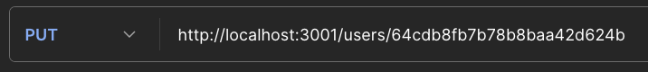
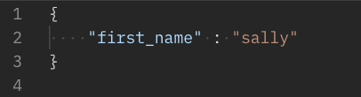

# T3A2 - B

## Installation of Backend 

**Step 1** -
Enter the backend folder from the terminal

```
cd backend
```

**Step 2** -
Create .env file in the root of the backend folder and add the below
```
DATABASE_URL= 
TOKEN_SECRET=
```

**Step 3** - 
Intall the packages
```
npm i
```

**Step 4** - 
To seed the data into the local database, enter the src folder

```
cd src
```

Then run

```
node seeds.js
```

**Step 4** - 
To start the database, get back into the root of the backend and run

```
npm run start-dev
```


## Installation of Frontend

**Step 1** -
Enter the frontend folder from the terminal

```
cd frontend
```

## Changes Made
 


## Testing  - Backend Locally

### Postman test log

| Feature  | Route | HTTP Method | Outcome | Comments |
| ------------- | ------------- | ------------- | ------------- | ------------- |
| Sign in  | /  | POST  | Passed  | Return with a token  |
| Create User | /users  | POST  | Passed  | No issue  |
| View all users  | /users | GET  | Passed  | No issue |
| View user by ID  | /users/:userid  | GET  | Passed  | No issue  |
| Update User  | /users/:userid  | PUT  | Passed  | No issue |
| Change Password  | /users/:userid/password  | PUT  | Passed  | No issue |
| Delete User  | /users/:userid  | DELETE  | Passed  | No issue |
| Create new Patient  | /paitents  | POST  | Passed  | No issue |
| View all Patients  | /paitents  | GET  | Passed  | No issue |
| View Patient by id  | /paitents/:paitentid  | GET  | Passed  | No issue |
| Update Patient  | /paitents/:paitentid  | PUT  | Passed  | No issue  |
| Delete Patient  | /paitents/:paitentid  | DELETE  | Passed  | No issue |
| Create new Appointment  | /appointments  | POST  | Passed  | No issue |
| View all Appointment  | /appointments  | GET  | Passed  | No issue |
| View Appointment by id  | /appointments/:appointmentid  | GET  | Passed | No issue  | 
| Update Appointment  | /appointments/:appointmentid  | PUT  | Passed  | No issue  |
| Delete Appointment  | /appointments/:appointmentid  | PUT  | Passed  | No issue  |


### Summary of routes
  


### Sign in
#### **Route**  


#### **Expected Output**  
Token for validation created

#### **Output** 


### Create User
#### **Route**  


#### **Input** 


#### **Expected Output**  
A user is created with the below data

```
    {
        "email": "admre@example.com",
        "password": "fwerwerw",
        "first_name": "Addfere",
        "last_name": "User",
        "title": "Mr.",
        "isAdministrator": true,
        "isPractitioner": false
    }
```

#### **Output** 


### Get All Users
#### **Route**  


#### **Expected Output**  


#### **Output** 


### Get User without Authorization


###  Get User By ID
#### **Route**  


#### **Expected Output**  


#### **Output**   


### Edit User
#### **Route**  


#### **Input** 


#### **Expected Output**  


#### **Output**  


###  Change Password


###  Delete User
#### **Route**  


#### **Expected Output**  


#### **Output** 


###  Create Patient Existing Email

#### **Output**   
    

###  Create Patient
#### **Route**  


#### **Input** 


#### **Expected Output**  
```
{
    "title": "Mr.",
    "first_name": "John",
    "last_name": "Doe",
    "preferred_name": "Johnny",
    "dob": "1980-01-01T00:00:00.000Z",
    "email": "erere.erer@example.com",
    "phone": "1234567890",
    "note": "Allergic to penicillin"

}
```

#### **Output**   


### Get All Patients
#### **Route**  
  

#### **Expected Output**  
All patients will be shown

#### **Output** 
    


###  Get Patient By ID
#### **Route**  
  


#### **Expected Output**  
The Patient with ID 64cdb8fa7b8baa42d6241 will be shown

#### **Output**   
  

###  Edit Patient
#### **Route**  
  

#### **Input** 
  

#### **Expected Output**  
The first name will be replaced be replaced by Sally

```
{
    "_id": "64cdb8fa7b78b8baa42d6241",
    "title": "Mr.",
    "first_name": "sally",
    "last_name": "Doe",
    "preferred_name": "Johnny",
    "dob": "1980-01-01T00:00:00.000Z",
    "email": "john.doe@example.com",
    "phone": "1234567890",
    "note": "Allergic to penicillin",
    "__v": 0
}
```

#### **Output**   
  

### Delete Patient
#### **Route**  
 

#### **Expected Output**  
A message will show that the patient is deleted

#### **Output**   
      

###  Create Appointment
#### **Route**  
  

#### **Input** 
 

#### **Expected Output**  
An appointment will be created with this data

```
{
    "practitioner" : "64cdb8fb7b78b8baa42d624f",
    "type" : "Standard Appointment",
    "patient": "64cdb8fa7b78b8baa42d6241",
    "startTime":"2023-12-01T14:30:00.000Z",
    "endTime":"2023-12-01T15:30:00.000Z",
    "note": "Test"
}
```

#### **Output**  
  

### Get All Appointments
#### **Route**  
  

#### **Expected Output**  
A message will show the details of all the appointment 

#### **Output** 
  


###  Get Appointment By ID
#### **Route**  
  

#### **Expected Output**  
A message will show the details of the appointment 

#### **Output**   
  

###  Edit Appointments
#### **Route**  
  

#### **Input** 
  

#### **Expected Output**  

#### **Output**   
  

###  Delete Appointments
#### **Route**  
 

#### **Expected Output**  
A message will show that the appointment is deleted

#### **Output**  
 

## Testing  - Frontend Locally


## Testing  - Deployment


## Libraries


## Project Management 
